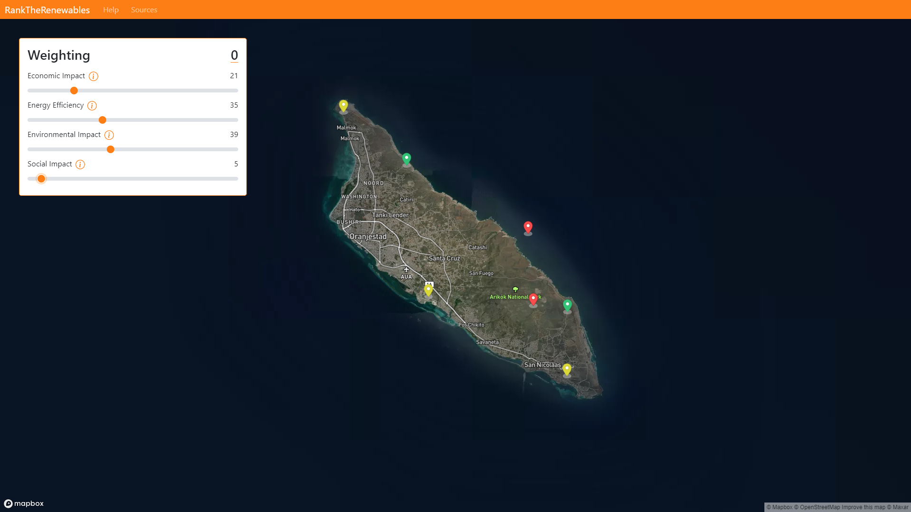
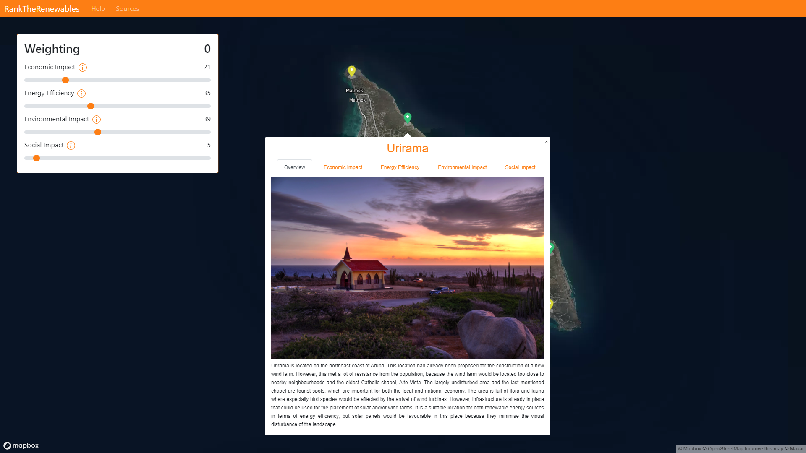

# RankTheRenewables
This web application is meant to be used as a tool for people to decide what is important for the selection of locations for renewable energy systems (RES) on Aruba. Four different aspects are considered: economic impact, energy efficiency, environmental impact, and social impact. By changing the weights of each aspect, the icons of the locations will have different colours based on their suitability for the given weighting. Each location contains an interdisciplinary overview and information for each aspect.

## Scalability
For our research project the target area is Aruba but this could easily be changed in two steps. First, in **map/static/map/index.js** the MapBox's center should be changed to the coordinates of the desired target area. Second, RES locations could be updated by using the admin interface to add and remove RES locations. Moreover, one could add or remove aspects/disciplines by editing the weighting menu's elements in **map/templates/map/index.html**.

## Screenshots
 
